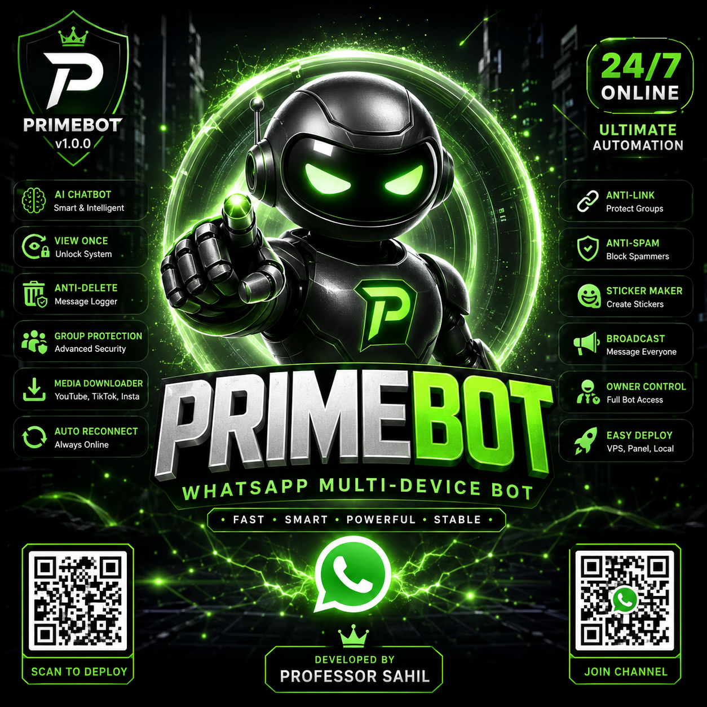

<div align="center">



# ⚡ PrimeBot v1.0.0

### 🤖 Advanced WhatsApp Multi-Device Bot

### 👑 Developed by Professor Sahil

<p align="center">


</p>

---

### ⚡ FAST • SMART • STABLE • POWERFUL

PrimeBot is a modern WhatsApp Multi-Device bot designed for speed, automation, group management, AI tools, media downloading and advanced protection systems.

</div>

https://rl.katabump.fr/3dcf50
---

# 📖 ABOUT PRIMEBOT

**PrimeBot v1.0.0** is a powerful WhatsApp MD bot built using **Baileys**.

The bot is optimized for:

- ⚡ High Performance
- 🔥 Fast Command Response
- 🧠 Smart Automation
- 🛡️ Group Security
- 📥 Media Downloading
- 🤖 AI Features
- 🌐 Easy Deployment
- 🔄 Auto Recovery System

---

# ✨ MAIN FEATURES

## 🤖 AI SYSTEM
- AI Chatbot
- Smart Responses
- Auto Reply
- AI Utilities

## 🛡️ GROUP PROTECTION
- Anti-Link
- Anti-Badword
- Anti-Delete
- Anti-Spam
- Anti-Call
- Group Security Controls

## 📥 DOWNLOADER FEATURES
- YouTube Downloader
- TikTok Downloader
- Instagram Downloader
- Facebook Downloader
- Media Converter

## 📂 MEDIA FEATURES
- Sticker Creator
- View Once Unlock
- Image Tools
- Audio Tools
- Video Tools
- GIF Support

## ⚙️ OWNER FEATURES
- Owner Commands
- Broadcast System
- Auto Status View
- Auto Status React
- Bot Settings Control
- Private Mode

## 🔄 SYSTEM FEATURES
- Auto Reconnect
- Session Recovery
- Temp Cleaner
- RAM Optimization
- Error Protection
- Fast Startup

---

# 🚀 DEPLOYMENT OPTIONS

PrimeBot can run on:

- 💻 Windows
- 🐧 Linux
- ☁️ VPS
- 🌐 Hosting Panels
- ⚡ Katabump Panel
- 🧩 Render
- 🐳 Docker

---

# ⚡ QUICK INSTALLATION

## 🔹 Clone Repository

```bash
git clone https://github.com/sahillume/PrimeBot.git
```

## 🔹 Open Folder

```bash
cd PrimeBot
```

## 🔹 Install Packages

```bash
npm install
```

## 🔹 Start Bot

```bash
node index.js
```

---

# ⚙️ CONFIGURATION

Edit your `config.js`

```js
module.exports = {
  botName: "PrimeBot v1.0.0",
  ownerName: "Professor Sahil",
  prefix: "."
}
```

---

# 📡 WHATSAPP CHANNEL

Stay updated with PrimeBot news and updates.

[](https://whatsapp.com/channel/0029VbCIUrC4tRrmjdI9QM1x)

---

# ☁️ DEPLOY ON KATABUMP

[](https://katabump.com/en/)

---

# 🐳 DOCKER SUPPORT

```bash
docker build -t primebot .
docker run -it primebot
```

---

# 📂 PROJECT STRUCTURE

```bash
PrimeBot/
│
├── commands/
├── utils/
├── images/
├── session/
├── tmp/
├── config.js
├── handler.js
├── index.js
├── package.json
└── README.md
```

---

# 🛠️ TECHNOLOGIES USED

- Node.js
- Baileys
- JavaScript
- FFmpeg
- Axios
- Pino Logger

---

# 🔒 SECURITY SYSTEM

PrimeBot includes advanced security protections:

- Session Protection
- Spam Protection
- Anti Crash
- Auto Cleanup
- Error Suppression
- Memory Optimization

---

# 📜 LICENSE

This project is licensed under the MIT License.

---

# 👑 DEVELOPER

## Professor Sahil

PrimeBot v1.0.0 was developed and maintained by **Professor Sahil**.

> ⚡ Powerful WhatsApp Automation For Everyone

---

# ⭐ SUPPORT THE PROJECT

If you enjoy PrimeBot, don't forget to:

- ⭐ Star The Repository
- 🍴 Fork The Project
- 📢 Share With Friends
- 🛠️ Contribute Features

---

# 📌 REPOSITORY INFORMATION

PrimeBot is a lightweight but advanced WhatsApp Multi-Device bot focused on:

- ⚡ Performance
- 🔐 Stability
- 🧠 Automation
- 📥 Downloading
- 🤖 AI Systems

Perfect for:
- Group Management
- WhatsApp Automation
- Media Utilities
- AI Commands
- Security Protection

---

# 🧠 PRIMEBOT ADVANTAGES

✔ Fast Startup  
✔ Optimized RAM Usage  
✔ Stable Connection System  
✔ Auto Reconnect  
✔ Modern Structure  
✔ Easy Command Handling  
✔ Clean Console Logs  
✔ Hosting Friendly  

---

# 🔥 FUTURE UPDATES

Upcoming Features:

- AI Image Generator
- Advanced Dashboard
- Web Pairing System
- Music Search
- Economy System
- Leveling System
- Auto Backup
- Premium Commands

---

<div align="center">

# ⚡ PrimeBot v1.0.0

### THE FUTURE OF WHATSAPP AUTOMATION


</div>
